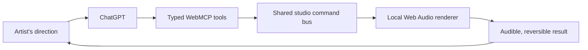

# Champagne

Champagne is a local-first music mastering studio where an artist and ChatGPT
shape the same audible master together. The artist describes the sound they
want; ChatGPT uses WebMCP to choose a proven Champagne baseline, apply small
bounded refinements, and coordinate trims, fades, and speed inside the live
studio.

**Live studio:** [champagne.vossx.chatgpt.site](https://champagne.vossx.chatgpt.site/)

**License:** [MIT](LICENSE). The five bundled showcase recordings and brand
assets have separate notes in [ASSET_LICENSES.md](ASSET_LICENSES.md).

## Try it in one prompt

1. Open Champagne in ChatGPT's in-app browser.
2. Select your own audio or click **Demo** to load one of five showcase tracks.
3. Ask ChatGPT for the complete result you want. For example:

   > Create a vibrant, electric, and powerful master. Trim the first second and
   > the last second. Fade the start and finish for two seconds on each side.
   > Increase track speed by 10%.

4. Listen to **Original** and **Mastered**, then continue the conversation or
   adjust the waveform and speed slider by hand.
5. Click **Download WAV** when the track is ready.

When WebMCP is unavailable, Champagne automatically presents its manual mode:
the four signature styles, the local mastering brief, waveform editing,
original/mastered monitoring, and the 50–150% speed slider. Those signature
buttons stay hidden in the WebMCP experience so the connected workflow remains
focused on the conversation.

## Why Champagne is a strong fit for WebMCP

Mastering is both technical and subjective. Artists naturally communicate in
goals such as “warmer,” “more open,” “punchier,” or “keep this master but trim
the intro.” A traditional interface makes them translate that intent into a
large collection of parameters before they can hear whether the translation
was right.

WebMCP gives ChatGPT a typed, semantic interface to the audio studio instead of
forcing it to guess at pixels. It can inspect compact studio state, call the
right mastering and editing operations, wait for each audible result, and use
the newly returned state for the next action. The artist remains in control of
the creative direction, the listening decision, every manual edit, and the
final file save.

### How this improves the experience

- **One musical request can describe the whole pass.** Mastering, trims, fades,
  and speed changes can be coordinated in the correct order.
- **Follow-ups preserve context.** An edit-only request changes the current
  master instead of silently creating a different one.
- **Every result is audible and visible.** ChatGPT and the artist operate the
  same live studio rather than separate hidden workflows.
- **Refinements stay musical.** ChatGPT works from four tested signatures and
  can make only small, bounded changes to the engine.
- **The artist can take over at any time.** Cut and fade handles, A/B playback,
  the speed slider, and the final download remain direct human controls.

## What people and agents can do together

The original Champagne macOS app gives artists four finished mastering
signatures. Its product interface does not expose the smaller tuning dimensions
behind those signatures. In the WebMCP studio, an artist describes a
track-specific destination; ChatGPT selects one validated signature as the safe
starting point, applies conservative refinements, and can coordinate the
mastering pass with non-destructive edits against the same live track.

| The artist | ChatGPT | Together |
| --- | --- | --- |
| Loads a track and describes the emotional or commercial goal | Reads redacted studio state and local analysis | Turn one natural-language direction into an audible mastering plan |
| Listens, compares Original and Mastered, and decides what feels right | Selects a safe baseline and maps the request to bounded controls | Iterate without losing the current master or overwriting the source |
| Drags cut/fade handles or changes speed when hand control is faster | Applies exact trims, fades, curves, and speed when requested | Keep manual actions and agent actions synchronized in one studio |
| Makes the final creative decision and clicks **Download WAV** | Prepares and commits the selected local result | Produce a 24-bit / 48 kHz WAV while the artist controls the save action |

That collaboration was not exposed by the prior macOS product UI. It offered
excellent fixed signatures; the WebMCP build turns their underlying musical
space into a safe conversational instrument.

## The bounded mastering model

ChatGPT is not given unlimited access to arbitrary DSP values. Champagne
provides a constrained musical vocabulary:

| Control | Allowed values |
| --- | --- |
| Mastering baseline | `Full Power`, `Warm Presence`, `Modern Crisp`, or `Dominant` |
| Overall intensity | −1 to +1 |
| Track-specific adjustments | Warmth, brightness, punch, dynamics, low end, presence, air, width, glue, density, and smoothness; each −1 to +1 |
| Priorities | Up to five of loudness, punch, warmth, clarity, dynamic range, low end, presence, air, width, glue, density, and smoothness |
| Safeguards | Up to four of preserve transients, avoid pumping, avoid harshness, avoid clipping, and keep dynamic |
| Speed | 50% to 150%; 100% is neutral |
| Fades | 0–30 seconds with curvature from −1 to +1 |

The local intent compiler also recognizes 25 named mastering directions. These
profiles help the manual brief interpret familiar language, while WebMCP lets
ChatGPT compose the same approved controls directly and precisely.

## How WebMCP is implemented

Champagne registers ten imperative, page-bound tools through
`document.modelContext.registerTool`. Each tool calls the same command functions
used by the visible studio, so an agent action updates the controls the artist
can see and hear.



| Purpose | WebMCP tools |
| --- | --- |
| Read the session | `get_studio_state`, `analyze_track` |
| Create and refine masters | `create_mastering_take`, `refine_mastering_take`, `create_variations` |
| Compare and select | `stage_comparison`, `commit_master` |
| Edit the current result | `set_trim_fades`, `set_track_speed` |
| Compatibility export preparation | `download_master` |

The export helper can prepare a WAV but cannot complete a browser save. The
visible **Download WAV** button is intentionally the final step.

### Shared-state safeguards

- Mastering and editing mutations carry the `expectedStateVersion` returned by
  the previous action. A stale call is rejected instead of overwriting a newer
  human or agent decision.
- Mastering takes are reversible revisions. Refining a take creates a child
  result and leaves its source intact.
- `set_trim_fades` and `set_track_speed` preserve the selected master.
- Tool results are compact and exclude audio bytes, PCM, waveform arrays, the
  local filename, and local paths.

## Privacy and file safety

User-selected audio is decoded, analyzed, rendered, played, resampled,
dithered, and encoded inside the browser. It is not included in WebMCP tool
payloads. The original file is never overwritten, every trim and fade is
non-destructive, and the user initiates the final save with **Download WAV**.

This local boundary is part of the product design: ChatGPT receives enough
structured state to direct the studio without receiving the music itself.

## Browser audio pipeline

The contest build ports Champagne's four authoritative style identities into a
real browser-native mastering path:

- 27 Hz cleanup high-pass
- bounded low, presence, and air tone shaping
- style-dependent compression and saturation
- bounded mid/side stereo width
- linked 5 ms look-ahead peak control
- mirrored, pressure-adjustable parabolic fade curves
- deterministic TPDF dither
- 24-bit / 48 kHz PCM WAV output

The native Swift/Accelerate engine remains the reference implementation. The
browser version is genuinely audible, but it does not claim sample-for-sample
parity with the full native mastering chain.

## Existing product and challenge-period work

Champagne predates the WebMCP Challenge as a native SwiftUI/macOS application.
The browser and agent experience were built during the challenge period.

| Before the challenge | Added for the WebMCP build |
| --- | --- |
| Native SwiftUI application | React/TypeScript browser studio |
| Four signature mastering styles | Ten typed WebMCP tools |
| Local AVFoundation/Accelerate DSP | Local Web Audio analysis, rendering, playback, and WAV encoding |
| Original/mastered monitoring | Natural-language, bounded track-specific refinements |
| Manual trim, fades, and WAV export | Combined mastering + trim/fade + speed workflows with state conflict checks |
| Desktop file workflow | Five hosted demo tracks and an in-browser judging path |

See [CHALLENGE_DELTA.md](CHALLENGE_DELTA.md) for the concise implementation
ledger and [docs/swift-to-webmcp.md](docs/swift-to-webmcp.md) for the migration
approach.

## Run the web studio locally

Champagne Web requires Node.js 22.13 or newer.

```bash
cd apps/web
npm ci
npm run dev
```

Use the local URL printed by Vinext. The bundled demos provide the most
repeatable path because browser support for user-supplied codecs varies.

Release checks:

```bash
npm run build
npx tsc --noEmit
```

## Build the native app

Open [`Champagne.xcodeproj`](Champagne.xcodeproj) in Xcode on macOS and build
the `Champagne` scheme.

## Repository map

| Path | Contents |
| --- | --- |
| `apps/web/` | Browser studio, Web Audio engine, WebMCP registration, and bundled demos |
| `Champagne/` | Native SwiftUI application and mastering engine |
| `docs/` | Migration notes, challenge evidence, and demo planning |
| `CHALLENGE_DELTA.md` | Existing-project versus challenge-period ledger |
| `ASSET_LICENSES.md` | Rights and attribution notes for bundled media and branding |

## Known boundaries

- Browser codec support varies by platform.
- A person must click **Download WAV** to complete the browser save.
- The browser engine preserves the native product's style identities, but full
  native DSP parity is future engineering work.
- The deployment and submission should be reviewed before anything is sent to
  Devpost.

## License

Source code is available under the [MIT License](LICENSE). See
[ASSET_LICENSES.md](ASSET_LICENSES.md) before redistributing the bundled music
or brand assets.
